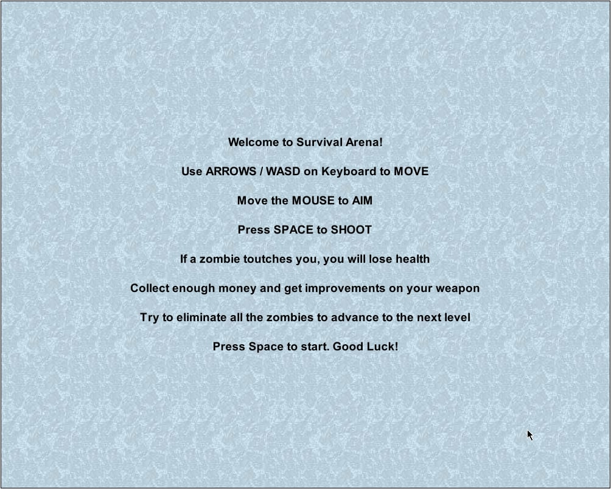
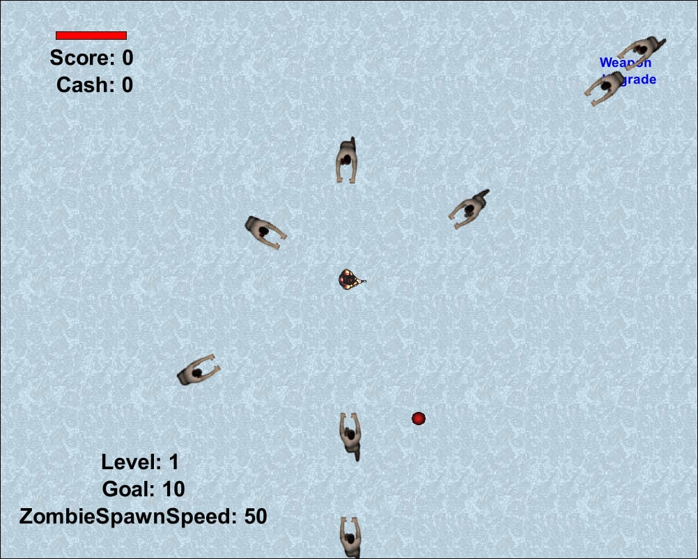
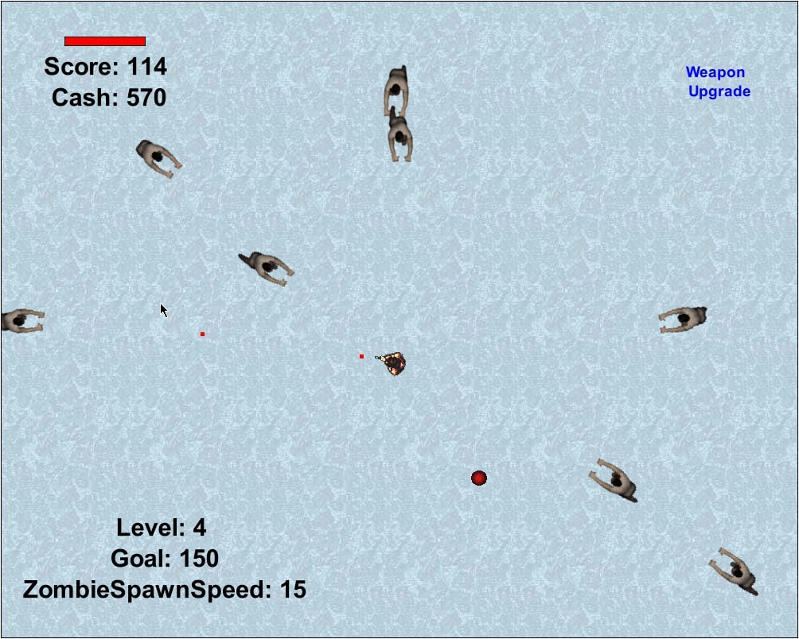
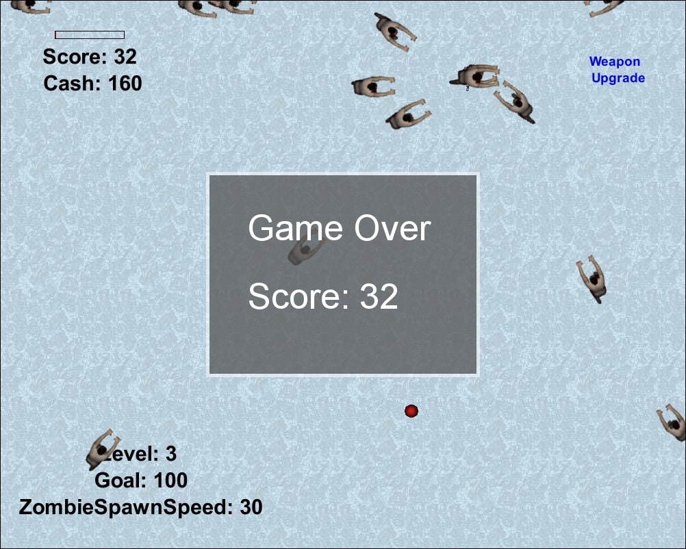

## Description
Survival_Arena is a Java-based game developed in Greenfoot for the second project during Serious Games Programming lessons at University. The player's objective is to survive as long as possible, overcome challenging levels, and achieve a higher score.

## Gameplay Overview
- **Objective:** Live as long as possible, overcome tough levels, and achieve a higher score.
- **Score Limit:** Reach a maximum of 150 points to reach Level 4.
- **Level Progression:** Levels alternate based on the player's score.
- **Difficulty Scaling:** As the player progresses through levels, zombies' speed and appearance on the map increase. Score goals and the speed at which health packs are available also change.
- **Weapon Upgrades:** Three upgrades available for weapon power.
- **Player's Life:** Restored to maximum with each level change.

## Controls
- **Movement:** ARROWS/WASD
- **Aim:** MOUSE
- **Shooting:** SPACE

## Screenshots
1. **Menu / Player in game:**
   
 

2. **Shooting / Game Over:**
   
 

## Getting Started
1. Download and extract .zip, .7z, or tar.gz file.
2. Download and install/run Greenfoot.
3. Open the folder or run project.greenfoot.exe.
4. Wait for the game to load and run.

## How to Play
1. Survive as long as possible, overcome levels, and aim for a high score.
2. Upgrade weapons and strategically use health packs to increase chances of survival.

## Game Features
- Dynamic level progression based on player score.
- Increasing difficulty with faster zombies and changing goals.
- Weapon upgrades to enhance player firepower.
- Health pack availability for sustaining player's life.
- Engaging gameplay for serious games programming learning.

## Graphics
- **Zombie:** [Top-Down Animated Zombie Set](https://opengameart.org/content/top-down-animated-zombie-set)
  - Edited in GIMP to cover less space on Greenfoot UI and approach the player without hitting.
- **Survivor:** [PGMMV Top-Down Shooter](https://bazratcreates.itch.io/pgmmv-top-down-shooter)
  - Walk PNG edited in GIMP to change layout and create additional frames, with disabled speed for a smoother animation.

## Sounds
- All sounds used are free and rights-free.
- Converted to MP3 format and edited to reduce file size.

## Role of each Class
- **MyWorld:** Basic objects creation, necessary class calls, randomization of zombie appearance, and adjustment of difficulty levels.
- **Level:** Represents a part of MyWorld that creates objects of type "level."
- **StartScreen:** Creates the start screen of the game with instructions and starts the game on space key press.
- **Bullet:** Contains objects of type "bullet" that create a red shape moving across the game. Disappears when it touches the outer frame.
- **Counter:** Manages score and money creation, displayed on the screen as Greenfoot images.
- **HealthBar:** Displays the character's life, creates the life bar, handles life loss or death, calls scoreboard, and manages other game functions.
- **HealthPack:** An empty class that creates objects of type "health pack."
- **LevelCounter:** Creates a Greenfoot image displaying the current level, its target, and the speed of introducing zombies.
- **Player:** Manages player actions, health pack consumption, and interactions with the environment.
- **ScoreBoard:** Creates objects of type scoreboard displaying the player's score and a message for winning or losing.
- **WeaponButton:** Creates an image allowing weapon upgrades for the user in exchange for money.
- **Zombie:** Manages zombie movement, animation, and interactions with the bullet object.

## Code Statistics

| Category                        | Value |
|---------------------------------|-------|
| Number of World Subclasses      | 3     |
| Number of Actor Subclasses      | 9     |
| Number of Other Classes         | -     |
| Lines of Code (LOC)             | 383   |

